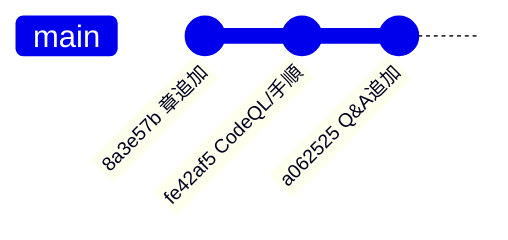
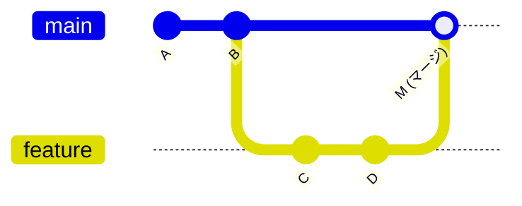

# git-learn

git の基本操作を学ぶための練習リポジトリです。

> **注意**: このリポジトリのデフォルトブランチは `master` です。  
> GitHub の新しいリポジトリではデフォルトが `main` になっていますが、`master` と `main` は**名前が違うだけで役割は同じ**です。どちらも「本流」となるブランチを指します。  
> コマンドの `master` の部分は、リポジトリによって `main` に読み替えてください。

---

## 目次

1. [リポジトリの初期化](#1-リポジトリの初期化)
2. [ファイルのステージングとコミット](#2-ファイルのステージングとコミット)
3. [ブランチ操作](#3-ブランチ操作)
4. [マージの種類](#4-マージの種類)
5. [クローン (clone)](#5-クローン-clone)
6. [リバート (revert)](#6-リバート-revert)
7. [フック (hooks)](#7-フック-hooks)
8. [その他よく使うコマンド](#8-その他よく使うコマンド)
9. [GitHub のコードスキャンとセキュリティ](#9-github-のコードスキャンとセキュリティ)
10. [GitHub Copilot](#10-github-copilot)
11. [コミットの範囲とブランチの見方（図解）](#11-コミットの範囲とブランチの見方図解)
12. [GitHub Mobile と GitHub Desktop](#12-github-mobile-と-github-desktop)

---

## 1. リポジトリの初期化

```bash
git init
```

カレントディレクトリを git リポジトリとして初期化します。`.git` フォルダが作成され、バージョン管理が始まります。

---

## 2. ファイルのステージングとコミット

```bash
git add ファイル名      # 特定のファイルをステージング
git add .              # すべての変更をステージング
git commit -m "メッセージ"  # コミット（変更を記録）
```

### ステージングとは？

「コミットに含めるファイルを選ぶ準備」のことです。  
変更 → `git add`（ステージング） → `git commit`（記録）の流れで作業します。

```
作業ディレクトリ  →  ステージング  →  コミット履歴
 (編集した状態)    (git add した状態)  (git commit した状態)
```

---

## 3. ブランチ操作

```bash
git branch ブランチ名              # ブランチを作成
git checkout ブランチ名            # ブランチを切り替え
git checkout -b ブランチ名         # 作成と切り替えを同時に行う
git branch                        # ブランチ一覧を表示
```

### ブランチとは？

作業の「分岐点」です。本流（master）を壊さずに新機能の開発や修正を行えます。

```
master:   A --- B --- C
                 \
FeatureA:         D --- E
```

---

## 4. マージの種類

### Fast-forward マージ

master に変更がない状態でブランチをマージすると、ポインタを前に進めるだけです。

```bash
git merge FeatureA
```

```
マージ前:  master: A --- B
                        \
           FeatureA:     C --- D

マージ後:  master: A --- B --- C --- D  (FeatureA と同じ状態)
```

### 通常マージ（マージコミット）

master とブランチの両方に変更があると、2つの親を持つマージコミットが作られます。

```bash
git merge FeatureA
```

```
マージ前:  master:   A --- B --- C
                          \
           FeatureA:       D --- E

マージ後:  master:   A --- B --- C --- M  (M はマージコミット)
                          \         /
           FeatureA:       D --- E
```

### 通常マージが「3-way マージ」である理由

通常マージ（マージコミット）の内部では **3-way マージ** という方式が使われています。

git は以下の **3つのコミット** を比較して、自動的に変更を統合します。

```
1. 共通の祖先 (Base)   ← 2つのブランチが分岐する前の状態
2. マージ元ブランチの先端 (Ours)
3. マージ先ブランチの先端 (Theirs)
```

```
         Base (分岐点)
        /              \
  Ours (master)    Theirs (FeatureA)
        \              /
         マージコミット M
```

#### 3-way マージのルール

| Base | Ours | Theirs | 結果 |
|---|---|---|---|
| 同じ | 変更あり | 変更なし | Ours の変更を採用 |
| 同じ | 変更なし | 変更あり | Theirs の変更を採用 |
| 同じ | 両方変更 | 両方変更 | **コンフリクト**（手動解決が必要） |
| 同じ | 同じ変更 | 同じ変更 | どちらかを採用（問題なし） |

#### コンフリクトとは？

同じ箇所を両方のブランチで別々に変更したとき、git はどちらを正解とすべきか判断できず、**コンフリクト（競合）** が発生します。

```bash
git merge FeatureA
# CONFLICT (content): Merge conflict in filea.txt
```

コンフリクトが起きたファイルには以下のようなマーカーが挿入されます。

```
<<<<<<< HEAD (master 側の変更)
master ブランチでの内容
=======
FeatureA ブランチでの内容
>>>>>>> FeatureA
```

手動で正しい内容に編集した後、以下でコミットします。

```bash
git add filea.txt
git commit -m "resolve merge conflict"
```

#### 2-way マージとの違い

単純に「Ours と Theirs の2つだけを比較」する **2-way マージ** では、  
どちらが変更したのか判断できず、変更がない箇所もコンフリクトとして扱われてしまいます。  
3-way マージは「分岐前（Base）」を加えることでこの問題を解決しています。

### squash マージ

ブランチの複数コミットを1つにまとめて取り込みます。ブランチの履歴は master に残りません。

```bash
git merge --squash FeatureB
git commit -m "merge FeatureB"
```

---

## 5. クローン (clone)

```bash
git clone リポジトリのURL
git clone リポジトリのURL フォルダ名  # 保存先フォルダ名を指定
```

### クローンとは？

GitHub などのリモートリポジトリをローカルにコピーしてくる操作です。  
コピーと同時にリモートが `origin` として自動的に設定されます。

```bash
# 例
git clone https://github.com/TetsuSuzu/git-learn
cd git-learn
```

クローン後は以下のコマンドでリモートの最新状態を取得できます。

```bash
git pull origin master   # リモートの変更をローカルに取り込む
git push origin master   # ローカルの変更をリモートに送る
```

---

## 6. リバート (revert)

```bash
git revert コミットID
```

### リバートとは？

「指定したコミットの変更を打ち消す新しいコミット」を作る操作です。  
過去のコミットを**削除しない**ため、チームでの共同作業でも安全に使えます。

```bash
# コミット履歴を確認して ID をコピー
git log --oneline

# 例: abc1234 のコミットを打ち消す
git revert abc1234
```

```
リバート前:  A --- B --- C  (C の変更が問題)
リバート後:  A --- B --- C --- D  (D が C を打ち消すコミット)
```

### revert と reset の違い

| コマンド | 動作 | 安全性 |
|---|---|---|
| `git revert` | 打ち消すコミットを新たに追加 | 安全（履歴を消さない） |
| `git reset` | コミット履歴を巻き戻して削除 | 危険（プッシュ済みには使わない） |

---

## 7. フック (hooks)

### フックとは？

git の特定の操作（コミット・プッシュなど）の**前後に自動で実行されるスクリプト**です。  
`.git/hooks/` フォルダ内に配置します。

```
.git/
└── hooks/
    ├── pre-commit        ← コミット前に実行
    ├── commit-msg        ← コミットメッセージの検証
    ├── pre-push          ← プッシュ前に実行
    └── post-merge        ← マージ後に実行
```

### フックの作成例（コミット前にチェック）

`.git/hooks/pre-commit` ファイルを作成し、実行権限を付与します。

```bash
#!/bin/sh
# コミットメッセージに TODO が含まれていたら警告する例
echo "pre-commit フック実行中..."
```

```bash
# 実行権限を付与（Mac/Linux）
chmod +x .git/hooks/pre-commit
```

### 代表的なフックの種類

| フック名 | タイミング | 用途例 |
|---|---|---|
| `pre-commit` | `git commit` の直前 | コードの静的解析、テスト実行 |
| `commit-msg` | コミットメッセージ確定前 | メッセージの書式チェック |
| `pre-push` | `git push` の直前 | テストが通るか確認 |
| `post-merge` | `git merge` の完了後 | 依存パッケージの自動インストール |

---

## 8. その他よく使うコマンド

```bash
git status                    # 作業ディレクトリの状態を確認
git log --oneline             # コミット履歴を1行ずつ表示
git log --all --oneline --graph  # ブランチも含めてグラフ表示
git diff                      # 変更内容を確認
git stash                     # 作業中の変更を一時退避
git stash pop                 # 退避した変更を戻す
```

---

## 9. GitHub のコードスキャンとセキュリティ

### コードスキャンとは？

リポジトリのコードを自動的に解析し、**潜在的な脆弱性やエラーを検出**する GitHub の機能です。
**コードスキャンによってコード内に潜在的な脆弱性またはエラーが見つかった場合、GitHub でリポジトリの「Security（セキュリティ）」タブにアラートが表示されます。**

```
コードをpush / PR作成
      ↓
コードスキャン（CodeQL など）が自動解析
      ↓
脆弱性・エラーを検出
      ↓
[Security] タブにアラート表示 → 内容を確認して修正
```

### 有効化の手順

1. GitHub でリポジトリを開く
2. **Settings → Code security（コードセキュリティ）**
3. **Code scanning** の項目で **CodeQL analysis** を有効化（Default 設定が簡単）
4. 以降、push や Pull Request のたびに自動で解析が実行される

### ワークフローで設定する場合（Advanced）

Default 設定の代わりに、ワークフローファイルで細かく制御できます。
このリポジトリには実例として [`.github/workflows/codeql.yml`](.github/workflows/codeql.yml) を用意しています。

```yaml
# 抜粋: push / PR / 毎週の定期スキャンで CodeQL を実行
on:
  push:
    branches: [ "master" ]
  pull_request:
    branches: [ "master" ]
  schedule:
    - cron: "0 0 * * 1"
# matrix.language に解析対象言語を指定（このリポジトリは actions。他に python / javascript-typescript など）
```

> `security-events: write` 権限により、解析結果が **Security タブ**へ書き込まれます。

### アラートの確認

- リポジトリ上部の **Security** タブ → **Code scanning alerts** で一覧表示
- 各アラートには「深刻度・該当箇所・修正方法」が示される
- Pull Request 上では、検出箇所に直接コメントとして表示されることもある

### GitHub の主なセキュリティ機能

| 機能 | 役割 |
|---|---|
| **Code scanning（CodeQL）** | コード内の脆弱性・エラーを静的解析で検出 |
| **Dependabot alerts** | 依存ライブラリの既知の脆弱性を検出・更新提案 |
| **Secret scanning** | APIキー・トークンなどの機密情報の漏洩を検出 |

> いずれも検出結果は **Security タブ**に集約され、リポジトリの安全性を継続的に確認できます。

---

## 10. GitHub Copilot

### GitHub Copilot とは？

**AI を利用したコーディングアシスタント**です。**インライン提案**と**会話型チャット**の両方を通じて、
開発環境から直接、**コードの生成・理解・リファクタリング・デバッグ**をリアルタイムで支援します。

### 2つの使い方

| モード | 内容 |
|---|---|
| **インライン提案** | 入力中のコードに対し、続きのコードを自動で候補表示（Tab で採用） |
| **Copilot Chat** | エディタ内のチャットで質問・依頼。コードの説明、修正、テスト生成などを対話で実行 |

### できること（例）

- **生成**: コメントや関数名から実装コードを提案
- **理解**: 既存コードの動作を自然言語で説明
- **リファクタリング**: より読みやすい・効率的なコードへ書き換え提案
- **デバッグ**: エラーの原因調査や修正案の提示

### 利用環境

- VS Code / Visual Studio / JetBrains IDE などの拡張機能
- GitHub.com 上の Copilot Chat
- コマンドライン（GitHub CLI の Copilot 拡張）

### 導入手順（IDE別）

> 事前に GitHub アカウントで **Copilot のライセンス**（個人プラン、または組織から付与）が有効である必要があります。

#### VS Code
1. 拡張機能ビューで **「GitHub Copilot」** を検索してインストール
   （チャットを使うには **「GitHub Copilot Chat」** も）
2. インストール後、GitHub アカウントで **サインイン**（右下や通知から認証）
3. 使い方:
   - **インライン提案**: コード入力中にグレーで候補表示 → `Tab` で採用、`Esc` で却下
   - **Copilot Chat**: サイドバーのチャットアイコン、またはエディタ内で `Ctrl + I`（Mac: `Cmd + I`）

#### Visual Studio
1. **拡張機能の管理** → 「GitHub Copilot」を検索してインストール（新しいバージョンは同梱）
2. IDE 右上から GitHub アカウントでサインイン
3. インライン提案は `Tab`、チャットは Copilot Chat ウィンドウから利用

#### JetBrains IDE（IntelliJ / PyCharm など）
1. **Settings → Plugins → Marketplace** で **「GitHub Copilot」** を検索してインストール
2. IDE を再起動し、**Tools → GitHub Copilot → Login to GitHub** でサインイン
3. インライン提案は `Tab`、チャットは Copilot Chat ツールウィンドウから利用

#### コマンドライン（GitHub CLI）
```bash
gh extension install github/gh-copilot   # Copilot 拡張を導入
gh copilot suggest "ブランチを作成して切り替えるコマンド"   # コマンドを提案
gh copilot explain "git rebase -i HEAD~3"               # コマンドの意味を説明
```

> コードスキャン（第9章）が「**書いたコードの安全性チェック**」を担うのに対し、Copilot は「**コードを書く・理解する作業そのもの**」を支援します。

### 理解度チェック（Q&A）

**Q1. GitHub Copilot とは何ですか?**
- ✅ **コードの候補を取得するために使用できる AI ペアプログラマ**
- OpenAI が作成した AI システム「OpenAI Codex」そのもの
- JavaScript パブリックリポジトリ
- （補足）Copilot は**ロジックを説明するコメントを書ける**ほか、ユーザーは提案コードを追加してソリューションを実装できます

> ポイント: Copilot は「AIペアプログラマ」。コード候補を提示する支援ツールです。

**Q2. GitHub Copilot でサポートされている IDE 拡張機能は?**
- VS Code と Visual Studio
- GitHub.com、VS Code、Visual Studio、Neovim、JetBrains
- ✅ **VS Code、Visual Studio、Neovim、JetBrains**

> ポイント: 「**IDE拡張機能**」が問われているため、IDE ではない GitHub.com は含まれません。

**Q3. GitHub Copilot Business と Enterprise の違いは?**
- ✅ **Enterprise には追加のパーソナル化レイヤーがあり、組織が独自のコードベースを使って Copilot をカスタマイズ（学習）できる**
- Enterprise だけにコード補完がある（誤り：補完は両方にある）
- Enterprise だけ IDE・モバイルでチャットできる（誤り）

> ポイント: Enterprise の差別化は「**組織のコードベースを活かしたパーソナル化**」。

**Q4. Pro の全機能に加え、追加の Premium 使用量と優先度の高いインフラアクセスを含むプランは?**
- GitHub Copilot Free
- GitHub Copilot Pro
- ✅ **GitHub Copilot Pro+**
- GitHub Copilot Enterprise

> ポイント: **Pro+** = Pro の全機能 ＋ 追加 Premium 使用量 ＋ 優先インフラアクセス。

---

## 11. コミットの範囲とブランチの見方（図解）

`git push` のときに表示される

```
fe42af5..a062525  master -> master
```

これは **新しいブランチが増えたわけではありません**。
`master` という **1本の道**の上で、コミットが `fe42af5` から `a062525` まで進んだ、という意味です。

### 図解①：master は一本道（今回のケース）

最近のコミットを古い→新しいの順に並べると、すべて `master` 上の一直線です。



絵で表すと：

```
（古い）                                          （新しい）
master: ●─────●─────●─────●─────●─────●─────●─────●  → これからも続く
                              8a3e57b fe42af5 a062525
                                              ▲
                                              HEAD（いま最新の位置）

「fe42af5..a062525」= ここからここまで、の区間（範囲）を指す表記
                      └─ fe42af5 の "次" から a062525 まで
```

> **ポイント**：`A..B` は「A の次から B まで」という**コミットの範囲**の言い方です。ブランチ名ではありません。

### 図解②：ブランチが「発生する」とはどういう状態か（対比）

枝分かれして初めて「ブランチ」です。今回はこの形には**なっていません**。



絵で表すと：

```
master:  ●───●───────────●  (M: あとで合流＝マージ)
          A   B         ╱
                   ╲   ╱
feature:            ●─●
                    C  D   ← master から枝分かれした“別の道”＝ブランチ
```

### まとめ

| 表示・用語 | 意味 | ブランチ？ |
|---|---|---|
| `fe42af5..a062525` | コミットの**範囲**（どこからどこまで進んだか） | いいえ |
| `master -> master` | ローカルの master を、リモートの master へ反映 | いいえ（同じ master） |
| `git branch feature` で作る `feature` | master から枝分かれした別の道 | **はい** |

> 今回の一連の作業は、すべて `master` 一本の上にコミットを積み重ねただけ。ブランチは増えていません。

---

## 12. GitHub Mobile と GitHub Desktop

GitHub アカウントには github.com 以外からもアクセスできます。
**GitHub Mobile** と **GitHub Desktop** は、さまざまなデバイスから GitHub を使うための便利な方法です。

### GitHub Mobile

場所を問わず素早く GitHub にアクセスできる、信頼できるファーストパーティ製クライアントアプリです。
**iOS / Android** の両方で利用でき、セキュアに GitHub データへアクセスできます。

できること：
- github.com からの**通知の管理・トリアージ・クリア**（スレッドの既読/ミュート/種類別フィルター）
- **issue / pull request** の読み取り・レビュー・コラボレーション
- pull request での**ファイル編集**
- ユーザー・リポジトリ・組織の検索・参照・操作
- ユーザー名を**メンション**されたときのプッシュ通知受信
- 特定のカスタム時間への**プッシュ通知のスケジュール**
- **2要素認証**による GitHub.com アカウントの保護
- 認識されていないデバイスでの**サインイン試行の確認**
- デスクトップを離れているときの軽量な GitHub タスクの実行

### GitHub Desktop

Git ワークフローを効率化する**オープンソースのアプリ**です。チーム内のコラボレーションや、Git/GitHub のベストプラクティス共有を促進します。
**Windows / macOS** で利用できます。

主な機能：
- リポジトリを追加して、既存プロジェクトを**ローカルで管理**
- GitHub からリポジトリを**クローン**して素早くローカル環境を用意
- **対話形式で変更をコミットに追加**し、コミット前の変更を管理・確認
- **共同編集者をコミットに追加**して適切な属性付け（コラボレーションの貢献を明確化）
- pull request を含む**ブランチの確認**
- **CI の状態表示**でコード品質を確保
- 変更された**画像の比較**（イメージファイルの更新を視覚的に確認）

### 使い分けの目安

| | GitHub Mobile | GitHub Desktop |
|---|---|---|
| プラットフォーム | iOS / Android | Windows / macOS |
| 主な用途 | 通知・レビュー・軽い編集を**外出先**で | ローカルでの**コミット/ブランチ/PR操作**をGUIで |
| 向いている場面 | 移動中のトリアージ・承認 | 本格的な開発・コミット作業 |

> どちらも**コマンドライン（git CLI）を補完**する手段です。CLIに不慣れでも、Desktop の GUI で add/commit/push/ブランチ操作を視覚的に行えます。

---

## このリポジトリで学んだこと

```
* 8618cfe merge FeatureB
| * 7db01c1 change2
| * 9d85f41 change1
|/
*   7c7d7d4 Merge branch 'FeatureA'
|\
| * 7361353 fix filec
* | fb5f696 change fileb
|/
* 2377e1e add filec
* 3de5cd5 unchange filea
* 13b4fe0 change filea
* 73229b8 This is first commit
```
