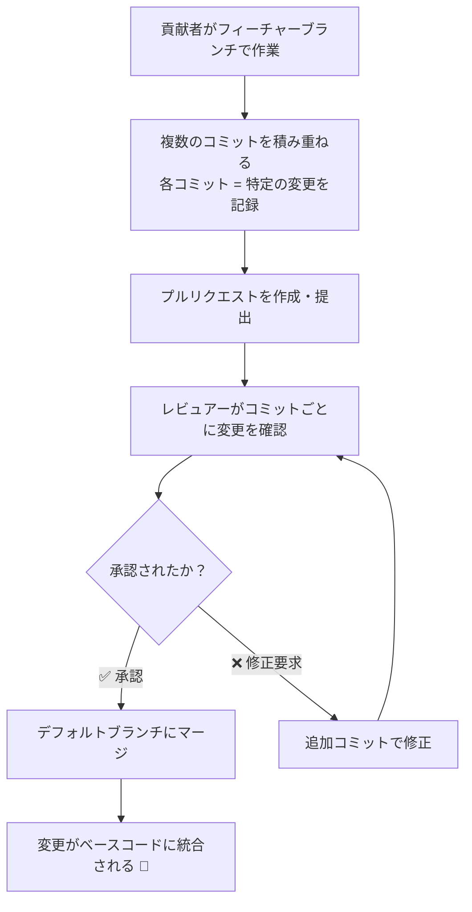
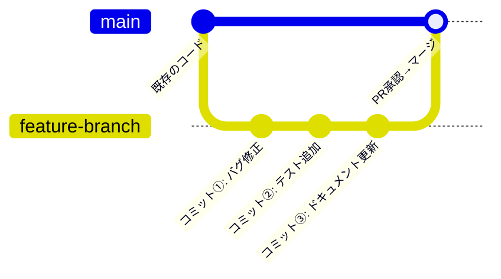

---

## 📌 プルリクエストとコミットの関係

---

## 🔍 プルリクエスト内のコミットの役割

| 要素 | 説明 |
|---|---|
| **個々のコミット** | 貢献者が行った**特定の変更**を1つ1つ記録 |
| **コミットの集合** | PR全体として「提案された修正の全体像」を形成 |
| **可視性** | PR作成者だけでなく**全ての関係者**が閲覧可能 |
| **マージ後** | デフォルトブランチのコミット履歴に統合される |

---

## 📝 コミットとPRの具体的なイメージ

---

## ❌ 他の選択肢がNGな理由まとめ

| 選択肢 | 問題点 |
|---|---|
| **「作成者のみ確認可能」** | ❌ PRのコミットは全ての関係者が閲覧可能。コラボレーションの基盤 |
| **「各コミットは別々の課題に独立貢献」** | ❌ 不完全。コミットはPR全体の変更に**まとめて貢献**するもの |
| **「リポジトリ全体のコミット履歴をまとめて示す」** | ❌ PRのコミットはそのPRに関連する変更のみを表す。全体履歴ではない |

---

## 📝 まとめ

> プルリクエスト内の**個々のコミット**は、貢献者が行った**特定の変更を明確に示す**役割を持ちます。  
> これらが積み重なることでPR全体の修正内容が形成され、  
> **承認後にデフォルトブランチへマージ**されることで、変更がベースコードに正式に統合されます。

🔗 公式ドキュメント：[About pull requests - GitHub Docs](https://docs.github.com/en/pull-requests/collaborating-with-pull-requests/proposing-changes-to-your-work-with-pull-requests/about-pull-requests)
